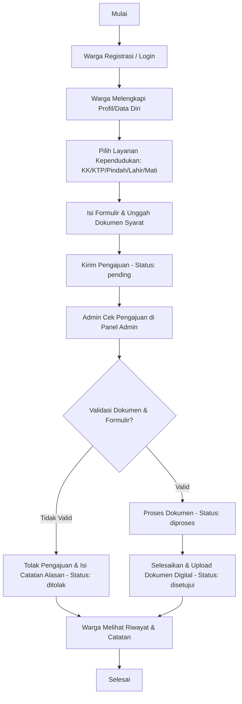
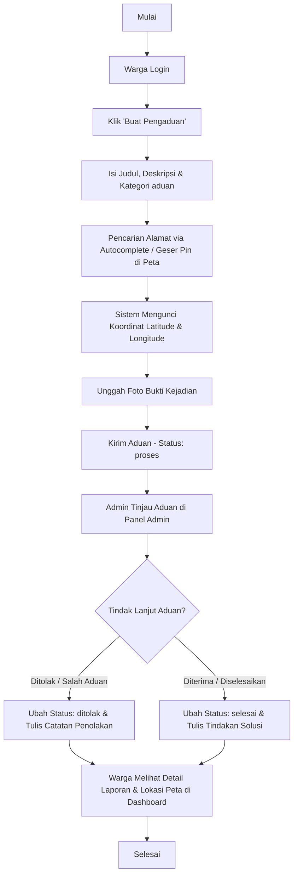

# Web Pengaduan & Layanan Kependudukan (Dukcapil Mandiri)

Aplikasi berbasis web untuk **Layanan Kependudukan Mandiri (Dukcapil Mandiri)** dan **Pengaduan Warga Berbasis Peta**.
Dibangun menggunakan **PHP Native (Custom MVC Architecture)**, **Bootstrap (SB Admin)**, dan integrasi peta dengan **Leaflet.js & Photon Autocomplete (Komoot API)**.

---

## 🛠️ Prasyarat (Prerequisites)

Sebelum menjalankan aplikasi di komputer lokal Anda, pastikan telah menginstal:
*   **Web Server**: Laragon (sangat disarankan) atau XAMPP.
*   **PHP**: Versi `8.1` atau lebih baru.
*   **Database**: MySQL / MariaDB.
*   **Node.js & npm** (untuk mengelola dependencies frontend/Gulp).

---

## 📥 Panduan Sinkronisasi & Update Setelah Clone/Pull

Jika Anda atau rekan tim Anda melakukan **git pull** dan perlu memperbarui database serta menjalankan aplikasi, ikuti langkah-langkah berikut:

### 1. Ambil Perubahan Terbaru dari Git
```bash
git pull origin main
```

### 2. Update Database MySQL
File SQL database tersimpan di direktori `database/`. Anda bisa melakukan update database secara otomatis atau manual:

#### Opsi 1: Otomatis via Terminal (Sangat Direkomendasikan 🚀)
Kami telah menyediakan script otomatis `migrate.php` untuk mempermudah setup database. Cukup jalankan perintah berikut di terminal/command prompt pada root project:
```bash
php migrate.php
```
*Script ini akan otomatis:*
1. Membuat database `pengaduan3` jika belum ada di MySQL Anda.
2. Membaca folder `database/` dan menerapkan file SQL yang belum pernah dijalankan secara berurutan.
3. Mencatat riwayat migrasi yang sudah berhasil agar tidak terjadi duplikasi impor di kemudian hari.

---

#### Opsi 2: Manual via phpMyAdmin atau SQL Client
Jika Anda ingin melakukannya secara manual:

##### Skenario A: Jika Belum Pernah Menginstall Sama Sekali (Instalasi Baru)
1. Buat database baru di MySQL dengan nama `pengaduan3` (sesuai setelan default di `config/database.php`).
2. Jalankan/import berkas-berkas SQL sesuai urutan berikut:
   *   `database/pengaduan3.sql` (Database dasar untuk admin & pengaduan lama)
   *   `database/dukcapil_mandiri.sql` (Skema dasar kependudukan digital/users)
   *   `database/migration_profil.sql` (Menambah kolom kelengkapan profil warga)
   *   `database/migration_kk.sql` (Menambahkan modifikasi kolom Kartu Keluarga)
   *   `database/migration_ktp.sql` (Menambahkan modifikasi kolom KTP)
   *   `database/migration_pindah.sql` (Skema pindah domisili & tabel keluarga pindah)
   *   `database/migration_kelahiran_kematian.sql` (Tabel kelahiran & kematian)
   *   `database/migration_pengaduan_baru.sql` (Tabel pengaduan warga dengan koordinat peta & foto bukti)

##### Skenario B: Jika Sudah Memiliki Database `pengaduan3` (Hanya Update Migrasi Terbaru)
Jika rekan tim Anda sudah pernah memasang database di komputernya dan hanya ingin memperbarui ke fitur terbaru (seperti **Pengaduan Warga Berbasis Peta & Multi-Foto**), cukup import file migrasi berikut:
*   `database/migration_pengaduan_baru.sql`

> [!TIP]
> **Cara Mengimpor SQL Melalui phpMyAdmin:**
> 1. Buka phpMyAdmin (`http://localhost/phpmyadmin`).
> 2. Pilih database `pengaduan3` di panel sebelah kiri.
> 3. Klik tab **Import** di bagian atas.
> 4. Pilih file `database/migration_pengaduan_baru.sql`.
> 5. Klik tombol **Import / Go**.

> [!TIP]
> **Cara Mengimpor SQL Melalui CLI (Command Line):**
> ```bash
> mysql -u root -p pengaduan3 < database/migration_pengaduan_baru.sql
> ```

### 3. Konfigurasi Koneksi Database
Sesuaikan parameter koneksi database Anda di file `config/database.php`:
```php
define('DB_HOST', 'localhost');
define('DB_NAME', 'pengaduan3');
define('DB_USER', 'root');
define('DB_PASS', 'PASSWORD_MYSQL_ANDA'); // Kosongkan jika menggunakan Laragon/XAMPP default
```

### 4. Instalasi Dependency Frontend & Gulp
Karena folder `vendor/`, `node_modules/`, dan asset bootstrap tertentu diabaikan oleh Git (`.gitignore`), Anda wajib meng-generate ulang asset tersebut:
1. Buka terminal pada root project.
2. Jalankan perintah instalasi dependency:
   ```bash
   npm install
   ```
3. Generate library statis ke folder `vendor/` menggunakan Gulp:
   ```bash
   npx gulp vendor
   ```
4. Build asset pendukung (CSS/JS compiled):
   ```bash
   npx gulp
   ```

---

## 🔄 Alur & Proses Kerja Website (Workflow)

Website ini memiliki 2 modul utama dengan alur kerja masing-masing:

### 1. Modul Layanan Kependudukan Mandiri (Dukcapil Mandiri)
Memungkinkan warga mengajukan pembuatan Kartu Keluarga (KK), KTP Baru, Surat Keterangan Pindah (SKP), Surat Kelahiran (F-2.01), dan Surat Kematian secara digital.



*   **Registrasi & Profil**: Warga mendaftar menggunakan NIK mereka dan disarankan melengkapi profil (alamat lengkap, RT/RW, pekerjaan, dll.) di halaman profil. Data profil ini akan otomatis mengisi (autofill) form pengajuan layanan.
*   **Pengajuan Layanan**: Warga mengisi formulir spesifik layanan, mengunggah prasyarat berkas (PDF/Gambar), dan mengirimkan permohonan.
*   **Verifikasi Admin**: Admin meninjau berkas permohonan melalui panel admin. Admin dapat memproses dokumen kependudukan digital, menyetujui (dengan mengunggah file hasil), atau menolak jika ada berkas yang tidak sesuai (disertai catatan tindak lanjut).

---

### 2. Modul Pengaduan Warga Berbasis Peta
Sistem bagi warga untuk melaporkan permasalahan infrastruktur, keamanan, kebersihan, sosial, kesehatan, atau kategori lainnya di wilayah desa menggunakan pin koordinat GPS (peta) dan bukti foto kejadian.



#### Penjelasan Fitur & Teknologi Pengaduan Warga:
1.  **Peta Interaktif (Leaflet.js)**: Terintegrasi dengan Leaflet Map dan ubin peta open-source. Warga dapat menandai lokasi kejadian dengan mengklik langsung di atas peta untuk memindahkan marker pin.
2.  **Pencarian Autocomplete (Photon Komoot API)**: Dilengkapi dengan kolom pencarian nama jalan/lokasi otomatis yang diarahkan khusus ke wilayah Indonesia (`lon=113.9213&lat=-0.7893` biasing) guna mempermudah penemuan nama lokasi lokal secara cepat.
3.  **Unggah Multi-Foto Bukti**: Warga dapat mengunggah satu atau beberapa file foto sekaligus sebagai bukti visual laporan. Sistem membatasi ukuran maksimal foto sebesar `5MB` per file dan membatasi ekstensi gambar (`jpg`, `jpeg`, `png`, `webp`).
4.  **Mini-Map Detail (Warga & Admin)**: Setelah dikirim, koordinat `latitude` dan `longitude` disimpan secara presisi di database. Halaman detail laporan (baik di sisi Warga berupa popup modal maupun di sisi Admin berupa halaman review khusus) menampilkan mini-map statis Leaflet yang langsung menunjuk ke titik lokasi aduan disertai pin marker yang tepat.

---

## 📂 Struktur Direktori Utama

*   📂 `app/` - Inti logika aplikasi (Custom MVC).
    *   📂 `Controllers/` - Pengendali alur request (misal: `PengaduanController.php`, `CitizenPengaduanController.php`, `AdminController.php`).
    *   📂 `Models/` - Interaksi dengan Database (misal: `PengaduanModel.php`, `UserAccount.php`).
    *   📂 `Views/` - File layout dan tampilan antarmuka (UI).
*   📂 `config/` - File konfigurasi database (`database.php`) dan sesi login (`auth.php`).
*   📂 `database/` - Kumpulan file migrasi SQL untuk inisialisasi & pembaruan database.
*   📂 `uploads/` - Folder penyimpanan berkas yang diunggah pengguna (foto profil, bukti pengaduan, dokumen pengajuan).
*   📂 `assets/` - Folder aset CSS, JS, dan Gambar statis.
*   📄 `buat_pengaduan.php` - Halaman entri form pengaduan warga.
*   📄 `pengaduan.php` - Halaman riwayat pengaduan warga.
*   📄 `admin.php` - Panel masuk admin utama.

---

## ⚡ Perintah Berguna Saat Development

*   **Menjalankan Watcher (Gulp & Browsersync)**:
    ```bash
    npm start
    ```
*   **Compile CSS/JS**:
    ```bash
    npx gulp
    ```
